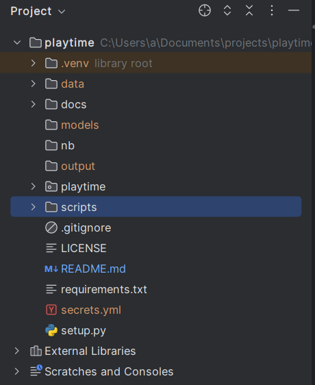

Playtime
======

Notes and important documentation I've picked up while working with various libraries on various projects, or even just playing around.

> Block quotes are directly from a source.

Normal text is my ramblings.

Sometimes, multiple lines of code will by inlined rather than as a block because pycharm lets me run inlined (python) code directly from the README. And it's runs in the project interpreter!

- [Quickstart](#quickstart)
  - [Virtual Environments](#virtual-environment)
  - [Pytorch](#pytorch)
  - [Directory and Project Structure](#directory-and-project-structure)
- [Microsoft Word](#microsoft-word)
- [Huggingface](#huggingface)
  - [Datasets](#datasets)
  - [Audio](#audio)
    - [Local Audio](#local-audio)
    - [Resampling](#resampling)
    - [Mapping](#mapping)
    - [Fine-Tuning](#fine-tuning)
  - [Vision](#vision)
  - [Pipelines](#pipelines)
  - [Stream](#stream)

# Quickstart

## Virtual Environment

```
python -m venv .venv
.venv\Scripts\activate
pip install -r requirements.txt
```

## PyTorch

Installing pytorch is a bit more effort than just `pip install...` unfortunately.

If we don't care about using our fancy GPU(s), we can install it just for cpu. The nice thing here is this works for both windows and linux. And mac, if that's you. And hey, you do you.

`pip3 install torch torchvision torchaudio --index-url https://download.pytorch.org/whl/cpu`

For gpu, linux and windows have the same command, but you first need to find the version of cuda on your system. For me, it's `cuda_12.1`. If you need to download cuda, you will likely need to download a (slightly) older version. As of right now, the newest version of cuda is 12.5, but pytorch supports up `11.8` and `12.1`. You can download archived versions of cuda [here.](https://developer.nvidia.com/cuda-toolkit-archive)

- [CUDA Toolkit 12.1.1](https://developer.nvidia.com/cuda-12-1-1-download-archive)
- [CUDA Toolkit 11.8.0](https://developer.nvidia.com/cuda-11-8-0-download-archive)

`nvcc --version`

`pip3 install --pre torch torchvision torchaudio --index-url https://download.pytorch.org/whl/nightly/cu121`

Also, important to note that pytorch only supports running ROCm on linux.

## Directory and Project Structure

# Hosting and Deployment

## Huggingface

### Huggingface Model Hub

`pip install huggingface_hub`

### Inference

- [Serverless](https://huggingface.co/docs/api-inference/index)
- [Dedicated](https://huggingface.co/docs/inference-endpoints/index)

## [Gradio](https://www.gradio.app/guides/quickstart)

> ✍️ Tip: When developing locally, you can run your Gradio app in hot reload mode, which automatically reloads the Gradio app whenever you make changes to the file. To do this, simply type in `gradio` before the name of the file instead of `python`. Learn more about hot reloading in the [Hot Reloading Guide.](https://www.gradio.app/guides/developing-faster-with-reload-mode)

## [Streamlit](https://streamlit.io/)

# Microsoft Word

Sometimes you just have to work with `.docx` files, unfortunately. They can be a bit of a pain to parse, but they're essentially just zipped `xml` files. [python-docx](https://python-docx.readthedocs.io/en/latest/) package is the best one I've found to create and manipulate `docx` files. And while it works fine for reading files, the documentation for that purpose is rather lacking.

`pip install python-docx`

I've included notes and a few code snippets in [`scripts\documents.py`](scripts/word_docs.py) regarding reading and writing word documents.

# PDF Parsing

It turns out parsing PDFs is hard. Really hard. The format is very exact, which is nice for producing aesthetically pleasing documents, but the way PDFs accomplish it is by placing items at exact locations. In some cases, this can make parsing pretty straightforward as you just need to locate the item on the page (or in the document structure) and read the text. Simple. Easy. Done.

The difficulty comes from two (common) occurrences:

1. Layout changing from one file to the next
2. Extra artifacts and structures placed on the page

The first is basically a given. Very rarely will you have multiple files with the same exact structure, unless possibly they were generated using a shared template. Even then, figures, authors, and a bunch of other factors may make a parser built for one file fail on the next.

The second is an issue because it can (and will) cause text to randomly appear in the extracted text. Headers, for instance, will cause extra lines to appear at the start of a page. Sometimes, while annoying, it's surmountable. Identify a common structure between pages and remove the first `N` lines at the start of every page. Footers can be dealt with similarly sometimes. Footnotes not so much. The issue with footnotes is their lack of consistency. They will (often) be pre-pended with a sequential number, and so you could try removing lines at the end of a page that follow this trend. But with a footer, they won't be at the end of a page. Again, doable, but annoying. Very annoying.

It seems the recommended path is to convert the PDF to an image and then use OCR to extract your text. But this still has an issue of location and changing structure. And so, it's hard to build a general purpose parser that works for PDFs. Instead, you have to build a parser for a specific layout. And at that point, it feels like it'd be faster to just copy-paste the text from the PDF I care about. Sure, we'd all still write the program, because why spend 5 minutes on something that you can automate in 4 hours?

I've built a few examples on parsing PDFs in [pdf_parse.py](scripts/pdf_parse.py) that I am building out as the need arises. For now, the best packages I've found (without going tht image->OCR route) are [`pdfminer.six`](https://github.com/pdfminer/pdfminer.six) and [`pypdf`.](https://github.com/py-pdf/pypdf)

I'm starting to hate PDFs almost as much as Word. Almost.

# Huggingface

[This](https://huggingface.co/) is just an amazing resource for transformers and machine learning in general.

Some of their stuff requires you to have an account (e.g. using gated public models). This also requires using an authorization token when accessing restricted functionality. So, rather than just committing my token to git like any sane developer, I added a `secrets.yml` file to hold my *precious*. To use this code as is, you'll want to create this file and place it in the top-most directory of the project (next to this README), as shown in the figure below.



Then, go to your account, generate a auth token, and add a line to `secrets.yml`. More details instructions about setting up and using an auth token for your account can be found [here.](https://huggingface.co/docs/hub/security-tokens) 

`huggingface_token: 'hf_...'`

As a final note, Huggingface's documentation is pretty amazing and thorough too, so I'm just going to be lazy and mostly quote relevant bits.

## Datasets

[Setup and installation](https://huggingface.co/docs/datasets/en/installation)

I primarily use pytorch, but you can use either pytorch, tensorflow, or jax.

`pip install datasets`

`python -c "from datasets import load_dataset; print(load_dataset('squad', split='train')[0])"`

```
{
  'answers': {
    'answer_start': [515],
    'text': ['Saint Bernadette Soubirous']
  },
  'context': 'Architecturally, the school has a Catholic character. Atop the Main Building\'s gold dome is a golden statue of the Virgin Mary. Immediately in front of the Main Building and facing it, is a copper statue of Christ with arms upraised with the legend "Venite Ad Me Omnes". Next to the Main Building is the Basilica of the Sacred Heart. Immediately behind the basilica is the Grotto, a Marian place of prayer and reflection. It is a replica of the grotto at Lourdes, France where the Virgin Mary reputedly appeared to Saint Bernadette Soubirous in 1858. At the end of the main drive (and in a direct line that connects through 3 statues and the Gold Dome), is a simple, modern stone statue of Mary.',
  'id': '5733be284776f41900661182',
  'question': 'To whom did the Virgin Mary allegedly appear in 1858 in Lourdes France?',
  'title': 'University_of_Notre_Dame'
}
```

## Audio

- [Load audio data](https://huggingface.co/docs/datasets/en/audio_load)
- [Process audio data](https://huggingface.co/docs/datasets/v2.2.1/en/audio_process)
- [Load and Explore](https://huggingface.co/learn/audio-course/en/chapter1/load_and_explore)
- [Pre-trained ASR Models](https://huggingface.co/learn/audio-course/chapter5/asr_models)

`pip install datasets[audio]`

`python -c "import soundfile; print(soundfile.__libsndfile_version__)"`

> To support loading audio datasets containing MP3 files, users should additionally install `torchaudio`, so that audio data is handled with high performance.

`pip install torchaudio`

> torchaudio’s `sox_io` backend supports decoding mp3 files. Unfortunately, the sox_io backend is only available on Linux/macOS, and is not supported by Windows.

> Audio datasets commonly have an `audio` and `path` or `file` column.

> `audio` is the actual audio file that is loaded and resampled on-the-fly upon calling it.

```python
from datasets import load_dataset

common_voice = load_dataset("common_voice", "tr", split="train")

print(common_voice[0]["audio"])
print(common_voice[0]["path"])
```

> When you access an audio file, it is automatically decoded and resampled. Generally, you should query an audio file like: `common_voice[0]["audio"]`. If you query an audio file with `common_voice["audio"][0]` instead, all the audio files in your dataset will be decoded and resampled. This process can take a long time if you have a large dataset.

> The path is useful if you want to load your own audio dataset. In this case, provide a column of audio file paths to [Dataset.cast_column()](https://huggingface.co/docs/datasets/v2.2.1/en/package_reference/main_classes#datasets.Dataset.cast_column):

`my_audio_dataset = my_audio_dataset.cast_column("paths_to_my_audio_files", Audio())`

### Local audio

> You can load your own dataset using the paths to your audio files. Use the `cast_column()` function to take a column of audio file paths, and cast it to the Audio feature:

```python
from datasets import Audio, Dataset
audio_dataset = Dataset.from_dict({"audio": ["path/to/audio_1", "path/to/audio_2", ..., "path/to/audio_n"]}).cast_column("audio", Audio())
print(audio_dataset[0]["audio"])
```

### Resampling

> Some models expect the audio data to have a certain sampling rate due to how the model was pretrained. For example, the `XLSR-Wav2Vec2` model expects the input to have a sampling rate of 16kHz, but an audio file from the Common Voice dataset has a sampling rate of 48kHz. You can use [Dataset.cast_column()](https://huggingface.co/docs/datasets/v2.2.1/en/package_reference/main_classes#datasets.Dataset.cast_column) to downsample the sampling rate to 16kHz:

`common_voice = common_voice.cast_column("audio", Audio(sampling_rate=16_000))`


### Mapping

> Just like text datasets, you can apply a preprocessing function over an entire dataset with [Dataset.map()](https://huggingface.co/docs/datasets/v2.2.1/en/package_reference/main_classes#datasets.Dataset.map), which is useful for preprocessing all of your audio data at once.

### Fine-Tuning

> For pretrained speech recognition models, such as `facebook/wav2vec2-large-xlsr-53`, a tokenizer needs to be created from the target text as explained [here](https://huggingface.co/blog/fine-tune-wav2vec2-english). The following example demonstrates how to load a feature extractor, tokenizer and processor for a pretrained speech recognition model.

```python
from transformers import AutoTokenizer, AutoFeatureExtractor, Wav2Vec2Processor
model_checkpoint = "facebook/wav2vec2-large-xlsr-53"
# after defining a vocab.json file you can instantiate a tokenizer object:
tokenizer = AutoTokenizer("./vocab.json", unk_token="[UNK]", pad_token="[PAD]", word_delimiter_token="|")
feature_extractor = AutoFeatureExtractor.from_pretrained(model_checkpoint)
processor = Wav2Vec2Processor.from_pretrained(feature_extractor=feature_extractor, tokenizer=tokenizer)
```

> For fine-tuned speech recognition models, you can simply load a predefined processor object with:
  
```
from transformers import Wav2Vec2Processor
processor = Wav2Vec2Processor.from_pretrained("facebook/wav2vec2-base-960h")
```

> Make sure to include the audio key in your preprocessing function when you call `Dataset.map()` so that you are actually resampling the audio data:

```python
def prepare_dataset(batch):
    audio = batch["audio"]
    batch["input_values"] = processor(audio["array"], sampling_rate=audio["sampling_rate"]).input_values[0]
    batch["input_length"] = len(batch["input_values"])
    with processor.as_target_processor():
        batch["labels"] = processor(batch["sentence"]).input_ids
    return batch

common_voice_train = common_voice_train.map(prepare_dataset, remove_columns=common_voice_train.column_names)
```

## Vision

`pip install datasets[vision]`

### Depth estimation

This is of particular interest as a lot of the time for low-cost and/or small applications, we only have a single camera to work with (assuming we have a camera in the first place). For instance, in small and FPV style drones, the view from the drone is from a single, mounted camera. The camera may be able to move (my moving the drone), but of course, this means we can't move the drone independently of the camera. And even when there is some independent movement between the two, the scale and types of movements are very limited (e.g. angle shift or swivel).

## Pipelines

`pip install -i https://pypi.org/simple/ bitsandbytes`

> If the model is too large for a single GPU and you are using PyTorch, you can set device_map="auto" to automatically determine how to load and store the model weights. Using the device_map argument requires the 🤗 Accelerate package.

## Stream
